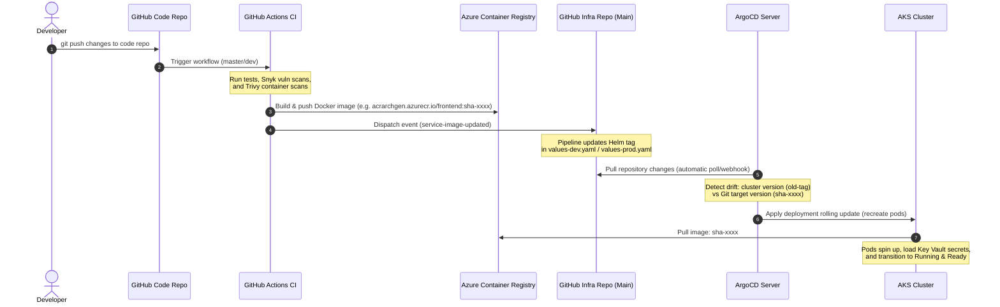

# ArchGen Platform — Cloud Architecture, Deployment & GitOps Guide

This document is a comprehensive guide detailing the **end-to-end cloud architecture**, **deployment instructions**, **Key Vault secrets reference**, and **infrastructure suggestions** for the ArchGen microservices platform.

---

## 1. Cloud Architecture & Suggestions Diagram

The platform is deployed on Azure Kubernetes Service (AKS) utilizing **Azure AD (Entra ID) Workload Identity** for passwordless token authentication and **Azure Key Vault Secrets Store CSI Driver** for configuration management. Development and Production environments are physically isolated into logical namespaces.

### 1.1 Infrastructure Topology Diagram
The diagram below shows the runtime networking, authentication flow, and database integration:

```mermaid
graph TD
    %% Clients
    UserDev["Developer Browser"]
    UserProd["End User Browser"]

    %% Ingress Layer
    subgraph IngressLayer ["Ingress Controller Layer (Dedicated IPs)"]
        IngressDev["dev Nginx Controller<br>(IP: 172.171.145.98 / Class: nginx-dev)"]
        IngressProd["prod Nginx Controller<br>(IP: 20.253.43.53 / Class: nginx-prod)"]
    end

    %% Namespaces
    subgraph DevNamespace ["dev Namespace"]
        FrontDev["archgen-dev-frontend<br>(Next.js on Port 3000)"]
        GWDev["archgen-dev-api-gateway<br>(Reverse Proxy on Port 8080)"]
        AuthDev["archgen-dev-auth-service<br>(FastAPI on Port 8001)"]
        ProjDev["archgen-dev-project-service<br>(FastAPI on Port 8002)"]
        ArchDev["archgen-dev-architecture-service<br>(FastAPI on Port 8003)"]
        SADev["Service Accounts<br>(Workload Identity enabled)"]
    end

    subgraph ProdNamespace ["prod Namespace"]
        FrontProd["archgen-prod-frontend<br>(Next.js on Port 3000)"]
        GWProd["archgen-prod-api-gateway<br>(Reverse Proxy on Port 8080)"]
        AuthProd["archgen-prod-auth-service<br>(FastAPI on Port 8001)"]
        ProjProd["archgen-prod-project-service<br>(FastAPI on Port 8002)"]
        ArchProd["archgen-prod-architecture-service<br>(FastAPI on Port 8003)"]
        SAProd["Service Accounts<br>(Workload Identity enabled)"]
    end

    %% Security & Storage
    subgraph AzureSecurity ["Azure Security & Identity Management"]
        UAMI["User-Assigned Managed Identity<br>(akspraveen-uami)"]
        KeyVault["Azure Key Vault<br>(kvpraveen)"]
    end

    subgraph AzureData ["Azure Private Database Tier"]
        PrivateEndpoint["Private Endpoint<br>(pe-cosmos on private subnet)"]
        CosmosDB["Azure Cosmos DB for MongoDB<br>(cosmospraveen)"]
    end

    %% Networking Paths
    UserDev -->|HTTP requests| IngressDev
    UserProd -->|HTTP requests| IngressProd

    IngressDev -->|/| FrontDev
    IngressDev -->|/api| GWDev
    GWDev -->|internal routing| AuthDev
    GWDev -->|internal routing| ProjDev
    GWDev -->|internal routing| ArchDev

    IngressProd -->|/| FrontProd
    IngressProd -->|/api| GWProd
    GWProd -->|internal routing| AuthProd
    GWProd -->|internal routing| ProjProd
    GWProd -->|internal routing| ArchProd

    %% Auth & Secret Mounts
    SADev -.->|federated token exchange| UAMI
    SAProd -.->|federated token exchange| UAMI
    UAMI -->|Key Vault Secrets User role| KeyVault
    KeyVault -.->|secrets mounted as files/envs| DevNamespace
    KeyVault -.->|secrets mounted as files/envs| ProdNamespace

    %% Private DB Connection
    ProjDev -->|private virtual link| PrivateEndpoint
    ProjProd -->|private virtual link| PrivateEndpoint
    AuthDev -->|private virtual link| PrivateEndpoint
    AuthProd -->|private virtual link| PrivateEndpoint
    ArchDev -->|private virtual link| PrivateEndpoint
    ArchProd -->|private virtual link| PrivateEndpoint
    PrivateEndpoint --> CosmosDB

    %% Styling
    classDef ingress fill:#f9f,stroke:#333,stroke-width:2px;
    classDef security fill:#ffd,stroke:#333,stroke-width:2px;
    classDef data fill:#dfd,stroke:#333,stroke-width:2px;
    class IngressDev,IngressProd ingress;
    class UAMI,KeyVault security;
    class CosmosDB,PrivateEndpoint data;
```



---

## 2. Key Vault Secrets Configuration

To recreate the infrastructure next time, the following secrets **must** be created in Azure Key Vault (`kvpraveen`). To separate configurations, secrets are prefixed with `dev-` or `prod-`.

### 2.1 Microservice Secrets Reference Table

| Key Vault Secret Name | Alias Env Var | Service | Description / Example Value |
|---|---|---|---|
| **API Gateway** | | | |
| `dev-gateway-port` / `prod-gateway-port` | `GATEWAY_PORT` | api-gateway | Internal proxy port (Default: `8080`) |
| `dev-production-origin` / `prod-production-origin` | `PRODUCTION_ORIGIN` | api-gateway | Public URL origin of the production API (e.g. `http://20.253.43.53`) |
| `dev-allowed-origins` / `prod-allowed-origins` | `ALLOWED_ORIGINS` | api-gateway, auth, proj, arch | Allowed CORS origins (e.g. `http://localhost:3000,http://172.171.145.98`) |
| `dev-auth-service-url` / `prod-auth-service-url` | `AUTH_SERVICE_URL` | api-gateway | Internal auth-service hostname (e.g. `http://archgen-dev-auth-service-auth-service:8001`) |
| `dev-project-service-url` / `prod-project-service-url` | `PROJECT_SERVICE_URL` | api-gateway | Internal project-service hostname (e.g. `http://archgen-dev-project-service-project-service:8002`) |
| `dev-architecture-service-url` / `prod-architecture-service-url` | `ARCHITECTURE_SERVICE_URL` | api-gateway | Internal arch-service hostname (e.g. `http://archgen-dev-architecture-service-architecture-service:8003`) |
| **Auth & Core Services** | | | |
| `dev-jwt-secret` / `prod-jwt-secret` | `JWT_SECRET_KEY` | auth, proj, arch | HMAC-SHA256 signature token key (Strong random 32-character string) |
| `dev-jwt-algorithm` / `prod-jwt-algorithm` | `JWT_ALGORITHM` | auth | Encryption algorithm (Default: `HS256`) |
| `dev-access-token-expire-minutes` / `prod-access-token-expire-minutes` | `ACCESS_TOKEN_EXPIRE_MINUTES` | auth | JWT token lifespan in minutes (Default: `30`) |
| `dev-refresh-token-expire-days` / `prod-refresh-token-expire-days` | `REFRESH_TOKEN_EXPIRE_DAYS` | auth | Lifespan of session refresh tokens in days (Default: `7`) |
| `dev-database-name` / `prod-database-name` | `DATABASE_NAME` | auth, proj, arch | Database Name in Cosmos DB (e.g. `archgen_db`) |
| `dev-cosmos-connection-string` / `prod-cosmos-connection-string` | `MONGO_URI` | auth, proj, arch | Cosmos DB Connection String (e.g. `mongodb://cosmospraveen:<key>@cosmospraveen.mongo.cosmos.azure.com:10255/?ssl=true...`) |
| **Architecture Service AI API Keys** | | | |
| `dev-openai-api-key` / `prod-openai-api-key` | `OPENAI_API_KEY` | architecture-service | API access key for OpenAI platform (starts with `sk-`) |
| `dev-openai-base-url` / `prod-openai-base-url` | `OPENAI_BASE_URL` | architecture-service | Custom endpoints if routing via proxy (Default: `https://api.openai.com/v1`) |
| `dev-openai-model` / `prod-openai-model` | `OPENAI_MODEL` | architecture-service | Model string for OpenAI synthesis (e.g. `gpt-4o`) |
| `dev-deepseek-api-key` / `prod-deepseek-api-key` | `DEEPSEEK_API_KEY` | architecture-service | API access key for DeepSeek API |
| `dev-ollama-base-url` / `prod-ollama-base-url` | `OLLAMA_BASE_URL` | architecture-service | Hostname endpoint of Ollama instance if run inside cluster |
| `dev-ollama-model` / `prod-ollama-model` | `OLLAMA_MODEL` | architecture-service | Ollama model name (e.g. `llama3`) |
| `dev-default-provider` / `prod-default-provider` | `DEFAULT_PROVIDER` | architecture-service | Fallback AI provider (e.g. `openai` or `deepseek`) |
| `dev-cache-enabled` / `prod-cache-enabled` | `CACHE_ENABLED` | architecture-service | Enable query caching (`true` / `false`) |
| `dev-cache-ttl` / `prod-cache-ttl` | `CACHE_TTL` | architecture-service | Cache lifespan (Default: `3600`) |
| `dev-max-provider-timeout` / `prod-max-provider-timeout` | `MAX_PROVIDER_TIMEOUT` | architecture-service | Timeout limit for AI provider responses (Default: `120`) |
| `dev-max-enrichment-time` / `prod-max-enrichment-time` | `MAX_ENRICHMENT_TIME` | architecture-service | Enrichment loop time threshold (Default: `60`) |
| `dev-log-level` / `prod-log-level` | `LOG_LEVEL` | architecture-service | Log detail output level (`INFO` / `DEBUG`) |
| `dev-archgen-generation-mode` / `prod-archgen-generation-mode` | `ARCHGEN_GENERATION_MODE` | architecture-service | Generation configuration (Default: `sync`) |

### 2.2 CLI Commands to Provision Secrets

Run these commands in the Azure CLI to provision the key vault secrets:
```bash
az login

# Set Key Vault Name
VAULT="kvpraveen"

# Create core secrets (Example for dev)
az keyvault set-secret --vault-name $VAULT --name "dev-cosmos-connection-string" --value "mongodb://..."
az keyvault set-secret --vault-name $VAULT --name "dev-jwt-secret" --value "SuperSecretRandomHMACKeyGeneratedForSecurity"
az keyvault set-secret --vault-name $VAULT --name "dev-openai-api-key" --value "sk-proj-..."
az keyvault set-secret --vault-name $VAULT --name "dev-deepseek-api-key" --value "sk-ds-..."
az keyvault set-secret --vault-name $VAULT --name "dev-database-name" --value "archgen_db"
az keyvault set-secret --vault-name $VAULT --name "dev-jwt-algorithm" --value "HS256"
az keyvault set-secret --vault-name $VAULT --name "dev-allowed-origins" --value "http://localhost:3000,http://172.171.145.98"
```

---

## 3. Exposing & Setting up ArgoCD

ArgoCD is installed in the cluster to manage resources in a declarative GitOps pattern.

### 3.1 Exposing the ArgoCD Dashboard
To make the dashboard accessible outside the cluster, change the type of the `argocd-server` service to `LoadBalancer`. This provisions a dedicated public IP address in Azure.

```bash
# Update service type to LoadBalancer
kubectl patch svc argocd-server -n argocd -p '{"spec": {"type": "LoadBalancer"}}'

# Retrieve the public IP address
kubectl get svc argocd-server -n argocd
```

### 3.2 Accessing the Dashboard
- **URL**: `https://<EXTERNAL-IP>` (Ignore the self-signed certificate warning in your browser)
- **Username**: `admin`
- **Retrieving the Initial Password**:
  ```bash
  kubectl -n argocd get secret argocd-initial-admin-secret -o jsonpath='{.data.password}' | base64 -d
  ```

---

## 4. Re-deploying the Infrastructure & Application

If you recreate the Kubernetes cluster from scratch, follow these sequential steps to deploy the application:

### Step 1 — Enable OIDC Issuer & Workload Identity on AKS
```bash
RESOURCE_GROUP="praveen-rg"
CLUSTER_NAME="akspraveen"

# Update AKS cluster configurations
az aks update \
  --resource-group $RESOURCE_GROUP \
  --name $CLUSTER_NAME \
  --enable-oidc-issuer \
  --enable-workload-identity
```

### Step 2 — Create Managed Identity & Role Assignments
Create the user-assigned identity to connect Kubernetes pods to Azure resources securely:
```bash
# Create the identity
az identity create \
  --name "akspraveen-uami" \
  --resource-group $RESOURCE_GROUP \
  --location "eastus"

# Retrieve Client ID and Principal ID
CLIENT_ID=$(az identity show --name "akspraveen-uami" --resource-group $RESOURCE_GROUP --query clientId -o tsv)
PRINCIPAL_ID=$(az identity show --name "akspraveen-uami" --resource-group $RESOURCE_GROUP --query principalId -o tsv)

# Grant access to Key Vault
az role assignment create \
  --role "Key Vault Secrets User" \
  --assignee-object-id $PRINCIPAL_ID \
  --scope /subscriptions/<SUBSCRIPTION-ID>/resourceGroups/$RESOURCE_GROUP/providers/Microsoft.KeyVault/vaults/kvpraveen
```

### Step 3 — Create Federated Identity Credentials
Link the Azure Managed Identity to the Kubernetes Service Accounts in both namespaces:
```bash
# Get the OIDC Issuer URL from AKS
OIDC_ISSUER=$(az aks show --name $CLUSTER_NAME --resource-group $RESOURCE_GROUP --query "oidcIssuerProfile.issuerUrl" -o tsv)

# DEV Namespace Bindings (Create for each microservice service account)
az identity federated-credential create \
  --name "fed-auth-dev" \
  --identity-name "akspraveen-uami" \
  --resource-group $RESOURCE_GROUP \
  --issuer $OIDC_ISSUER \
  --subject "system:serviceaccount:dev:archgen-dev-auth-service-sa" \
  --audiences "api://AzureADTokenExchange"

# PROD Namespace Bindings (Create for each microservice service account)
az identity federated-credential create \
  --name "fed-auth-prod" \
  --identity-name "akspraveen-uami" \
  --resource-group $RESOURCE_GROUP \
  --issuer $OIDC_ISSUER \
  --subject "system:serviceaccount:prod:archgen-prod-auth-service-sa" \
  --audiences "api://AzureADTokenExchange"
```
*(Create corresponding federated identity credentials for `project-service-sa`, `architecture-service-sa`, and `api-gateway-sa` in both namespaces).*

### Step 4 — Install CSI Secrets Store Driver
Install the Secrets Store CSI Driver Helm Chart configured for Azure:
```bash
helm repo add csi-secrets-store-provider-azure https://azure.github.io/secrets-store-csi-driver-provider-azure/charts
helm repo update

helm install csi-secrets-store-provider-azure csi-secrets-store-provider-azure/csi-secrets-store-provider-azure \
  --namespace kube-system \
  --set secrets-store-csi-driver.enableSecretRotation=true
```

### Step 5 — Apply ArgoCD Application Manifests
Deploy the core applications using GitOps:
```bash
# Deploy controllers
kubectl apply -f argocd/ingress-dev-controller.yaml
kubectl apply -f argocd/ingress-prod-controller.yaml

# Deploy applications
kubectl apply -f argocd/dev-application.yaml
kubectl apply -f argocd/prod-application.yaml
```

---

## 5. GitOps CI/CD Deployment Workflow

The continuous integration and deployment flow is completely automated using GitHub Actions and ArgoCD:



---

## 6. Infrastructure Recommendations for High Availability

To move this system towards a production-ready enterprise-grade environment, we suggest the following improvements:

1. **Deploy cert-manager & Let's Encrypt**:
   Install `cert-manager` in the cluster to automatically generate and rotate Let's Encrypt SSL/TLS certificates for the public-facing ingresses instead of serving pages over unencrypted HTTP (Port 80).
2. **Private Link for Container Registry (ACR)**:
   Restrict access to `acrarchgen.azurecr.io` by setting up a Private Endpoint. This prevents images from being pulled over the public network and prevents access key exposure.
3. **Multi-Region DB Replication**:
   Enable geo-replication on Cosmos DB (`cosmospraveen`) in Azure. This ensures low read-latency and seamless failover capabilities in the event of an Azure datacenter outage.
4. **Horizontal Pod Autoscaling (HPA)**:
   Enable HPA resources (which are configured but can be tuned) based on CPU and memory limits. This automatically scales replica counts from 2 to 5 during high traffic spikes.
