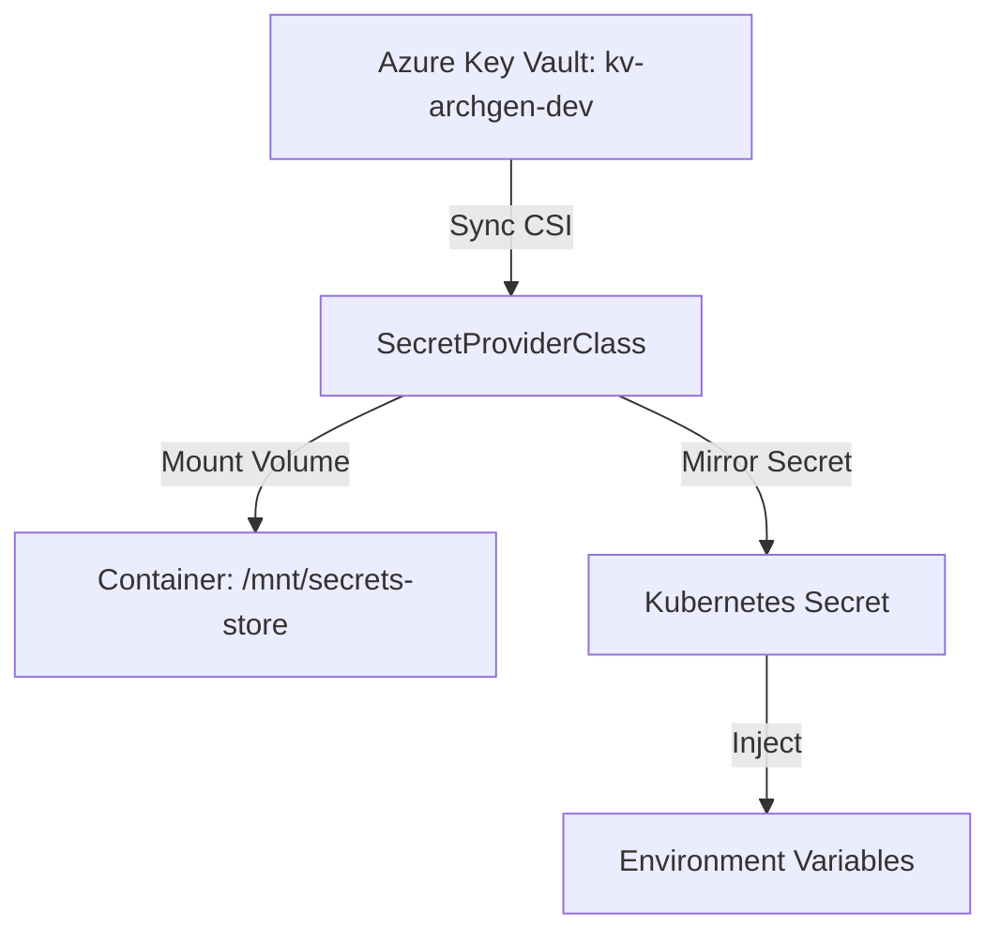

# Infrastructure & GitOps (Infra)

This repository orchestrates the infrastructure, GitOps pipelines, container orchestration, secret integration, and networking policies for the ArchGen microservices cluster. It maps out standard deployments using **Helm charts**, handles declarative delivery using **ArgoCD**, integrates with **Azure Key Vault**, and isolates development (`dev`) and production (`prod`) workloads.

---

## 1. Directory Structure

The repository coordinates configurations across directories:

```
Infra/
├── argocd/               # ArgoCD Application manifests (dev vs prod applications)
├── k8s/                  # Helm charts for each microservice
│   ├── api-gateway/      # Ingress and reverse proxy chart
│   ├── auth-service/     # Authentication service chart (Key Vault enabled)
│   ├── project-service/  # Project management chart (Key Vault enabled)
│   ├── architecture-service/ # AI generator chart (Key Vault enabled)
│   └── frontend/         # Next.js SPA chart
├── manifests/            # Raw environment overlay manifests (dev & prod)
│   ├── dev/              # Dev secret provider classes and deployments
│   └── prod/             # Prod secret provider classes and deployments
└── terraform-azure/      # Terraform modules and environments for Azure resources
```

For more detailed guides, refer to:
* [Deployment and Architecture Guide](file:///c:/Users/Praveen/Desktop/New%20folder/Infra/DEPLOYMENT_AND_ARCHITECTURE_GUIDE.md)
* [Reading Guide](file:///c:/Users/Praveen/Desktop/New%20folder/Infra/READING_GUIDE.md)
* [Secrets and Config Reference](file:///c:/Users/Praveen/Desktop/New%20folder/Infra/SECRETS_AND_CONFIG.md)

---

## 2. Namespace Isolation (`dev` vs `prod`)

To isolate development testing from client-facing production traffic, resources are deployed into separate Kubernetes Namespaces:

| Attribute | Dev Namespace (`dev`) | Prod Namespace (`prod`) |
|---|---|---|
| **Domain** | `dev.printnow.space` | `printnow.space` |
| **Ingress Hosts** | `dev.printnow.space` (frontend)<br>`dev.printnow.space/api` (gateway) | `printnow.space` (frontend)<br>`api.printnow.space` (gateway) |
| **Git Branch** | `dev` | `master` |
| **Argo Application** | `dev-application` | `prod-application` |
| **Key Vault** | `kv-archgen-dev` | `kv-archgen-prod` |

* **DNS Resolution**: Pods resolve downstream services within their own namespace using short names (e.g. `http://auth-service-sa`). This isolates database sessions, environment states, and traffic.
* **Resource Quotas**: Development boundaries prevent potential memory/CPU leaks in development pods from exhausting resources required for production services.

---

## 3. Secret Management: Azure Key Vault & CSI Driver

To prevent exposing static secret YAMLs in Git, secrets are stored in Azure Key Vault and mounted dynamically inside the pods using the **Secrets Store CSI Driver**:



1. **SecretProviderClass**: Configured per service in [manifests/](file:///c:/Users/Praveen/Desktop/New%20folder/Infra/manifests). It specifies the Azure Key Vault name and maps key vault secrets to local files.
2. **CSI Mount**: When a pod starts, the Secrets Store CSI driver connects to Key Vault, fetches secrets, and mounts them as text files at `/mnt/secrets-store/<secret-alias>` inside the container.
3. **Environment Injection**: The driver synchronizes these values into standard Kubernetes Secrets, which are then injected into container runtime environments as environment variables (e.g. `JWT_SECRET_KEY`, `MONGO_URI`, `OPENAI_API_KEY`).

---

## 4. Azure Workload Identity (OIDC Federated Credentials)

Rather than storing long-lived service principal client secrets inside the cluster, pods authenticate to Azure using **Workload Identity** (passwordless federation):

1. **OIDC Issuer**: AKS acts as an OpenID Connect (OIDC) token issuer. It signs temporary JSON Web Tokens generated for pod Service Accounts.
2. **User-Assigned Managed Identity**: A managed identity (`akspraveen-uami`) is granted the `Key Vault Secrets User` role on Key Vault `kv-archgen-dev` / `kv-archgen-prod`.
3. **Federated Credentials**: Federated credential links associate the managed identity with the Kubernetes Service Account subject:
   - Dev Subject: `system:serviceaccount:dev:archgen-dev-auth-service-sa`
   - Prod Subject: `system:serviceaccount:prod:archgen-prod-auth-service-sa`
4. **Token Exchange**: On pod startup, the workload identity webhook injects OIDC token paths. The Azure SDK exchange this temporary token for an access token to fetch secrets securely.

---

## 5. GitOps Delivery Pipeline (ArgoCD)

Deployment delivery follows the GitOps pattern managed by ArgoCD. Desired cluster states are defined declaratively in Git and synchronized automatically:

* **Dev ArgoCD App** ([dev-application.yaml](file:///c:/Users/Praveen/Desktop/New%20folder/Infra/argocd/dev-application.yaml)):
  - Source Path: `manifests/dev`
  - Target Namespace: `dev`
  - Tracks Repository Branch: `dev`
* **Prod ArgoCD App** ([prod-application.yaml](file:///c:/Users/Praveen/Desktop/New%20folder/Infra/argocd/prod-application.yaml)):
  - Source Path: `manifests/prod`
  - Target Namespace: `prod`
  - Tracks Repository Branch: `master`
* **Drift Detection**: ArgoCD compares the active cluster resources with Git definitions. If a resource configuration is changed manually in the cluster, ArgoCD flags it as `OutOfSync` and reconciles it to match Git configuration.
